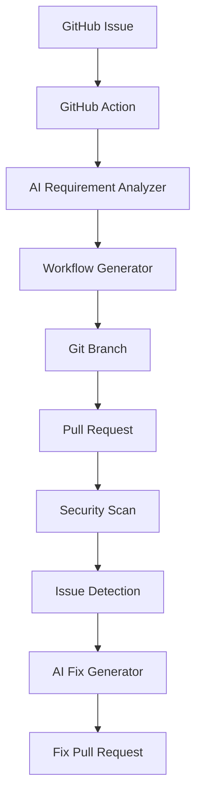

# AI-Powered DevOps Automation (Demo/MVP)

A GitHub-native AI DevOps assistant that turns a plain-language GitHub Issue into
a working CI/CD pipeline, scans code/containers for security issues, and opens
Pull Requests with AI-suggested fixes — all through GitHub Issues, Actions,
branches, and PRs. No separate backend, frontend, or database.

## 1. What This Project Does

1. A user opens a GitHub Issue describing an application/DevOps requirement.
2. `ai-requirement.yml` fires automatically, analyzes the issue (via an LLM,
   with a rule-based fallback), generates a GitHub Actions workflow, validates
   it, and opens a PR.
3. `security-scan.yml` runs on every PR/push, scanning code (Bandit, a custom
   scanner, optionally Semgrep) and container images (Trivy).
4. When issues are found, `ai-fix.yml` (manually triggered) generates AI
   suggested fixes and opens a separate "fix" PR for human review.
5. **Nothing is auto-merged and nothing is auto-deployed.** A human always
   reviews and merges.

## 2. Architecture



### Components

| Path | Purpose |
|---|---|
| `.github/workflows/ai-requirement.yml` | Triggered on new Issues; analyzes requirement, generates workflow, opens PR |
| `.github/workflows/security-scan.yml` | Triggered on PR/push; runs Bandit, custom scanner, Semgrep, Trivy |
| `.github/workflows/ai-fix.yml` | Manually triggered (`workflow_dispatch`); generates and PRs a fix |
| `scripts/analyze_requirement.py` | LLM-based (OpenAI) + keyword-fallback requirement analyzer |
| `scripts/generate_workflow.py` | Turns structured requirements into a validated GitHub Actions YAML |
| `scripts/scan_code.py` | Detects hardcoded passwords/secrets, debug prints, dangerous shell/eval usage |
| `scripts/generate_fix.py` | LLM-based (or template fallback) fix generator for a detected issue |
| `scripts/create_pr.py` | Shared helper: create branch, commit, push, open PR via `gh` or REST API |
| `examples/sample-requirement.md` | Example Issue text to paste in to trigger the demo |
| `examples/vulnerable_app.py` | Deliberately vulnerable file for demonstrating detection + fixes |
| `tests/` | Unit tests for the Python scripts (no network calls required) |

## 3. Setup

```bash
git clone <this-repo>
cd Ai-Factory-Demo
pip install -r requirements.txt
pytest tests/
```

No AI provider is required to try the demo — every script falls back to a
deterministic rule-based implementation when `OPENAI_API_KEY` is absent, so
the pipeline is always runnable.

## 4. Required GitHub Secrets

| Secret | Required | Purpose |
|---|---|---|
| `OPENAI_API_KEY` | Optional | Enables LLM-based requirement analysis and fix generation. Without it, scripts use rule-based fallbacks. |
| `GITHUB_TOKEN` | Provided automatically by Actions | Used to push branches and open PRs. No manual setup needed for the default token; ensure the repo setting **Settings → Actions → General → Workflow permissions** allows "Read and write permissions" and "Allow GitHub Actions to create and approve pull requests". |

No API keys, tokens, or secrets are ever printed to logs by these scripts.

## 5. How to Create the Demo Issue

Open a new Issue in this repository with:

**Title:** `Generate CI/CD Pipeline`

**Body:** (see [examples/sample-requirement.md](examples/sample-requirement.md))

```
Create a CI/CD pipeline for a Python FastAPI application.

Requirements:
- Install Python dependencies.
- Run unit tests using pytest.
- Run a security scan.
- Build a Docker image.
- Scan the Docker image.
- Deploy to Kubernetes.
- Use GitHub Actions.
- Do not expose secrets in the workflow.
```

## 6. How the Workflow Works

1. `issues: opened` triggers `ai-requirement.yml`.
2. `scripts/analyze_requirement.py` extracts structured JSON (language,
   framework, testing, security_scan, docker, kubernetes, cloud, deployment).
3. `scripts/generate_workflow.py` renders `.github/workflows/ci-cd.yml` from
   that JSON and validates it with `yaml.safe_load`.
4. A branch `ai/requirement-issue-<number>` is created, the file is committed,
   pushed, and a PR is opened with the requirements, generated changes, and
   validation results in the description.

## 7. How to Run the Security Scan

Automatically: any PR or push to `main` triggers `security-scan.yml`, running
Bandit, the custom `scripts/scan_code.py`, optional Semgrep, and Trivy (if a
`Dockerfile` is present).

Manually / locally:

```bash
python scripts/scan_code.py examples/vulnerable_app.py
```

## 8. How to Trigger AI Fix

From the **Actions** tab, select **AI Fix**, click **Run workflow**, and
supply the `issue_number` input (or the PR/issue number you're fixing for).
The workflow scans the repo, generates suggested fixes for any HIGH/CRITICAL
findings, and opens a PR titled `AI Generated Fix (Issue #<number>)`.

## 9. How the Pull Request Is Generated

`scripts/create_pr.py` creates a branch, commits the generated/fixed files,
pushes, and opens the PR using the GitHub CLI (`gh pr create`) if available,
falling back to the GitHub REST API (`POST /repos/{owner}/{repo}/pulls`) using
`GITHUB_TOKEN`. PRs always include requirements, generated changes/fix
details, validation notes, and security considerations — and always require
human review before merge.

## 10. Permissions

Each workflow declares only the permissions it needs:

```yaml
permissions:
  contents: write        # commit generated files / fixes
  pull-requests: write   # open PRs
  issues: read           # read the triggering issue
```

`security-scan.yml` only needs `contents: read` plus `pull-requests: write`
for summary comments. None of the workflows use `permissions: write-all`.

## 11. Safety Guarantees

- No workflow auto-merges a PR.
- No workflow deploys to real infrastructure; the "Deploy to Kubernetes" step
  is a placeholder comment, not a real deployment.
- No script prints API keys, tokens, passwords, or secrets.
- All credentials are read from environment variables backed by GitHub
  Secrets.

## 12. Limitations of This Demo

- Requirement analysis and fix generation are best-effort; without
  `OPENAI_API_KEY` they use simple keyword/template heuristics, not true LLM
  reasoning.
- Workflow generation currently has a dedicated template only for Python;
  other languages get a minimal generic placeholder.
- `scripts/scan_code.py` uses regex-based detection, not a full AST/security
  analyzer — it complements but does not replace Bandit/Semgrep/Trivy.
- Kubernetes deployment is stubbed out; no cluster credentials or real
  deployment logic are included.
- This is a single-repository MVP, not a multi-tenant or multi-agent
  platform.